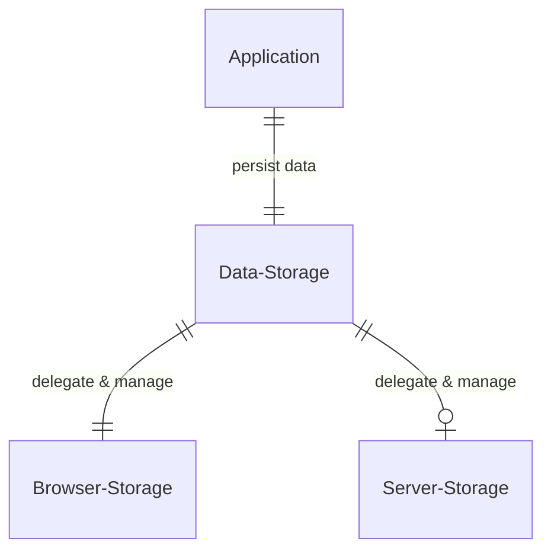
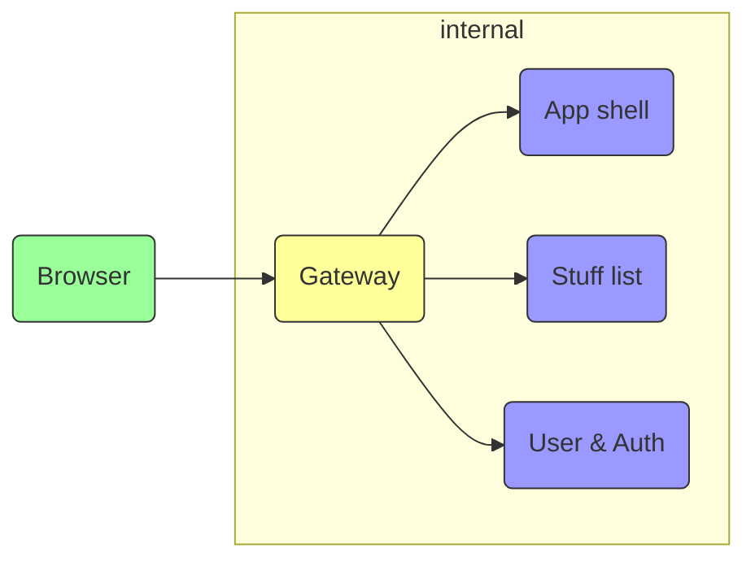

# System design

### Table of content
* [Data persistent model](#data-persistent-model)
* [Network and distribution model](#network-and-distribution-model)

### Data persistent model

### Network and distribution model

